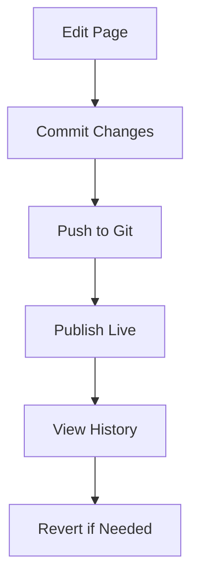

## Overview

You create and manage your Noor Al Shams documentation using an intuitive interface that supports both visual editing and Markdown. Organize content into pages and sections, collaborate with version control, and publish updates seamlessly. This guide covers adding pages, editing content, and basic version control.

<Columns cols={3}>
  <Card title="Add Pages" icon="file-plus" href="#adding-pages">
    Create new documentation pages quickly.
  </Card>
  <Card title="Edit Content" icon="edit-3" href="#editing-content">
    Update text, code, and media.
  </Card>
  <Card title="Version Control" icon="git-branch" href="#version-control">
    Track changes with Git integration.
  </Card>
</Columns>

## Adding Pages and Sections

Follow these steps to add new pages and organize them into sections.

<Steps>
  <Step title="Navigate to Pages" icon="layout">
    Open the sidebar and select **Pages**. Click **New Page**.
  </Step>
  <Step title="Set Title and Path" icon="edit">
    Enter a title like "API Reference" and a path such as `/docs/api`. Choose a parent section if nesting under an existing folder.
  </Step>
  <Step title="Add Frontmatter" icon="file-text">
    Add YAML frontmatter at the top:

````mdx
```yaml
---
title: API Reference
description: Endpoints and usage examples
---
```
````

  </Step>
  <Step title="Publish" icon="upload">
    Save and publish. Your page appears in the navigation.
  </Step>
</Steps>

<Callout kind="tip">
  Use descriptive paths like `/guides/quickstart` for better SEO and navigation.
</Callout>

## Editing Content

Edit pages using visual tools or Markdown. Switch between modes based on your preference.

<Tabs>
  <Tab title="Visual Editor" icon="mouse-pointer">
    Drag and drop components like images and callouts. Highlight text, then apply bold or links via the toolbar.

    <Image
      src="https://example.com/visual-editor-screenshot.png"
      alt="Visual editor interface showing drag-and-drop components"
      width="800"
      height="500"
    />
  </Tab>
  <Tab title="Markdown Editor" icon="code">
    Write raw MDX for full control. Preview changes in real-time.

    <CodeGroup tabs="MDX,YAML">
```mdx
## Quick Start

Install via npm:

```bash
npm install noor-al-shams
```
```
```yaml
---
title: Quick Start
sidebar_position: 1
---
```
    </CodeGroup>
  </Tab>
</Tabs>

## Version Control Basics

Integrate Git to track changes, collaborate, and revert edits.

### Connect Repository

<Expandable title="Setup Git Integration" default-open="true">
  Link your GitHub repo:
  1. Go to **Settings > Version Control**.
  2. Enter your repo URL: `https://github.com/your-org/noor-docs`.
  3. Authorize access.
</Expandable>

### Commit and Push Changes

Use these commands from your local clone:

<CodeGroup tabs="Git CLI,GitHub Desktop">
```bash
git add .
git commit -m "Add editing guide"
git push origin main
```
```bash
# In GitHub Desktop:
# 1. Stage changes
# 2. Write commit message: "Update API docs"
# 3. Push to main
```
</CodeGroup>

<Callout kind="warning">
  Always pull latest changes before editing: `git pull origin main`.
</Callout>

### View History

Access commit history via the page editor. Revert to previous versions with one click.



Your documentation stays organized and versioned, enabling smooth team workflows. Explore advanced features like branches in the settings panel.